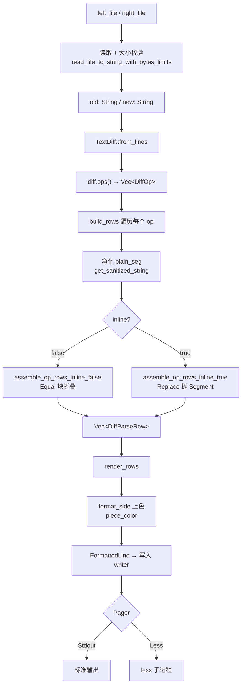
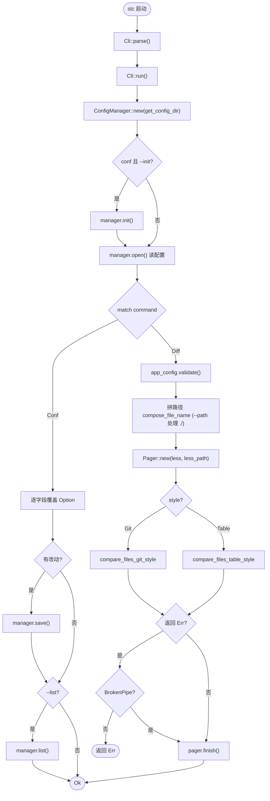

# 简单文本比较工具

> 干中学

# `similar`文本比较基础

## 构造文本差异对象

```rust
let diff = TextDiff::from_lines(old, new)
```

差异对象通过`TextDiff::from_lines(old, new)`进行构建，`TextDiff`是一个结构体，结构体中存储的三类数据：

- `old`/`new`的`TextDiffSide`枚举变体
- `ops`块组成的`vec`容器
- `newline_terminated`等信息字段

### `old`和`new`是如何使用的

- 这两个参数在函数参数列表是是按值使用，并要求其实现`IntoDiffInput`这个特征，在[源码](https://docs.rs/similar/latest/src/similar/text/abstraction.rs.html#83)中，为`&str`/`String`/`Cow`分别实现了这个特征，因此，传入的参数既可以是借用的形式，也是可以移动的形式
  - 这两种不同形式，影响了`TextDiff`结构体中`old`/`new`的[TextDiffSide](https://docs.rs/similar/latest/src/similar/text/mod.rs.html#154)变体，该枚举有两个变体，一个是借用形式，一个是拥有形式

- `old`和`new`中的文本，按照换行符`\n`/`\r`/` \r\n`进行切分，分成一个个`token`，并基于`token`进行差异比较
  - 需要注意的是，换行符仍然保留在文本内

### `ops`是什么

`ops`是枚举`DiffOp`的对象，表示的是，**某一块**的差异，可以通过`diff.ops()`来访问切片，直接打印某个`ops`，返回的是这种

```
Equal   { old_index: 0,              new_index: 0, len: 5      }
Insert  { old_index: 12,             new_index: 11, new_len: 3 }
Delete  { old_index: 10, old_len: 1, new_index: 10             }
Replace { old_index: 5, old_len: 1,  new_index: 5, new_len: 1  }
```

- 首先是差异标签，可以通过`ops.tag()`来访问，对应`DiffOp`的四个变体，`Equal`/`Insert`/`Delete`/`Replace`
  - 具体某段差异被解析为`Insert`/`Delete`还是`Replace`，由具体算法控制，不在本文讨论，本文只使用默认算法
- 枚举中的四个变体，都是结构体类型，对应不同的字段，具体信息可以通过`ops.old_range()`/`ops.new_range()`来获取`Range`对象
  - `Equal`类型，表示新旧文本中相同的片段，因此只有各自起始位置+长度
  - `Delete`类型，表示新文本相较于旧文本中没有的，因此只有旧文本中的起始位置和长度，以及对应新文本的缺失的位置
  - `Insert`类型，与`Delete`正相反，是只存在于新文本而旧文本没有，因此只有旧文本中对应插入的位置，和新文本中的起始位置和长度
  - `Replace`类型，是一段综合描述，表示旧文本起始位置到具体长度位置，被新文本中起始位置到具体长度位置，进行了替换

### 新行

文本比较时，会出现这种情况，文档最后，可能某个文档以新行为结尾，也可能以最后一行有实际文本的结尾，这种会被特殊标记出来

`missing_newline()`驱动`NO_NEWLINE`标记

- `Change.missing_newline()`
- `InlineChange.missing_newline()`

### 统一输出

`TextDiff`提供了一个方法`diff.unified_diff()`，用于返回一个统一差异的格式器，也即一个[UnifiedDiff](https://docs.rs/similar/latest/similar/udiff/struct.UnifiedDiff.html)的实例

可以直接打印该实例，输出是类似`git diff`的样子，但是没有增加颜色等控制

如果要进行颜色控制，必须对其内部的[hunk](https://docs.rs/similar/latest/similar/udiff/struct.UnifiedDiffHunk.html)进行逐个处理

- `hunk`是结构体`UnifiedDiffHunk`的实例
  - `header()`方法用于获取该`hunk`的头部信息，即`@@ -a,b +c,d @@，`的信息
  - `iter_changes()`方法用于获取hunk内部的每个`Change`对象，该对象包含具体文本信息

### 获取`Change`对象

`TextDiff`提供了`iter_all_changes()`的方法，用于将每个`DiffOp`块展平到具体信息，每个`Change`对象形状如下

```
Change { tag: Equal, old_index: Some(0), new_index: Some(0), value: "SimpleTextCompare 测试文本 A\n" }
Change { tag: Delete, old_index: Some(5), new_index: None, value: "version = 1.0.0\n" }
Change { tag: Insert, old_index: None, new_index: Some(5), value: "version = 1.1.0\n" }
```

`Change`对象和`DiffOp`最大的一个差别就是，没有`Replace`这个类型，它的`tag()`方法返回的是`ChangeTag`类型，是将`Replace`拆解为对应的`Delete`/`Insert`

可以通过`tag()`/`new_index()`/`old_index()`/`value()`来获取对应的标签，新文本索引，旧文本索引和值

### 非`inline`的获取

本程序中，对于非`inline`的获取没有使用`iter_all_changes`，使用的是`diff`+`op`的方式

- 通过`op.old_range()`/`op.new_range()`获取索引
- 使用`diff.old_slice(idx)`/`diff.new_slice(idx)`获取对应的文本

### `inline`的获取

`inline`模式要启用`features = ["inline"]`

`inline`这种模式其实只会出现在`DiffTag::Replace`里，其他情况不会出现，因此只对该类型进行特殊处理

使用`diff`的`iter_inline_changes(op)`方法，该方法返回的一个项如下

```
InlineChange { tag: Equal, old_index: Some(0), new_index: Some(0), values: [(false, "SimpleTextCompare 测试文本 A\n")] }
InlineChange { tag: Delete, old_index: Some(5), new_index: None, values: [(false, "version = "), (true, "1.0.0"), (false, "\n")] }
InlineChange { tag: Insert, old_index: None, new_index: Some(5), values: [(false, "version = "), (true, "1.1.0"), (false, "\n")] }
```

其中，`values()`方法返回的内容，是将一行文本拆开后，按照`(bool, text)`的元组形式返回的`vec`容器，其中`bool`表示是否强调，也即为`true`表示该元组内的`text`是不同的

# 模型设计

整体输出以`git`和`table`两个样式为主

- `git`样式使用`unified_diff`，遍历每个`hunk`，为其着色
- `table`样式处理较为复杂，按照表格模式进行展示
  - 对于`inline`/非`inline`，统一了数据格式，便于后续代码统一处理
  - 对于`Equal`块，通过配置决定是否折叠，以便于大量连续的`Equal`可以方便的查看

因此，对于`table`样式，单独创建了对应的数据对象

## `Segment`结构体

由于`inline`模式下，返回的`values`是一个`Vec<(bool, str)>`，因此为了统一处理，声明了`Segment`结构体

用于表示该元组

```rust
pub struct Segment {
    pub emphasis: bool,
    pub seg_text: String,
}
```

## `Row`结构体

`Row`结构体用来表示`table`输出样式中的一行数据，但是，并不表示是最终结果，因为`Row`对象内部的文本还需要进行折叠加染色

```rust
pub struct Row {
    pub left_no: Option<usize>,
    pub right_no: Option<usize>,
    pub left_line: Option<Vec<Segment>>,
    pub right_line: Option<Vec<Segment>>,
    pub status: LineStatus,
}
```

## `DiffParseRow`枚举

枚举有两个变体，`Diff`和`Folded`

- `Diff`是元组变体，元组元素为`Row`结构体
- `Folded`是一个结构体类型变体，`left_start`/`right_start`/`count`三个字段，`left_start`/`right_start`是被折叠部分在左右两侧的起始行号（= 块起始 + radius + 1，跳过了前面显示的 radius 行上下文），`count`是被折叠的行数（= 总长 − 2×radius）

## `LineStatus`枚举

自定义差异类型，用于着色

# 数据流

## 数据变换-`table`样式



## `run`流




# 终端命令行与配置文件


# 大文件处理

# 折叠处理

# 终端转义注入处理

# 着色处理

# `less`处理


